# Xenu Link Sleuth

## 介绍

Xenu’s Link Sleuth是一款检查网站死链接的软件。可以通过它打开一个本地网页文件来检查它的链接，也可以输入任何网址来检查。它可以分别列出网站的活链接以及死链接，连转向链接它都分析得一清二楚；支持多线程，可以把检查结果存储成文本文件或是网页文件。

这个工具最大的特点就是操作简单，便于使用个，功能强大，而且只有几百KB，非常的小，他可以检测网页中文字、图片、插件、脚本等几乎所有的链接，还可以将链接结果存储成Excel文件和.xen文件。


## 主要功能

可以检测到网页中的普通链接、图片、框架、插件、背景、样式表、脚本和java程序中的链接


**主界面截图**


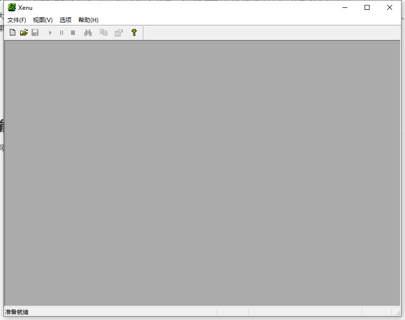


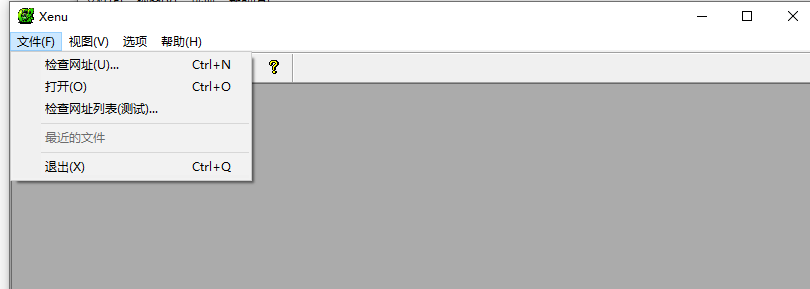


## 使用方法

通过Xeun可以有效地检测出网站中无效的页面，发现和链接相关的错误。可以用以下三种方式输入要检测的网站


### 直接输入URL检测

打开软件，运行程序后单击文件（File）菜单，选择检查URL（Check URL）命令


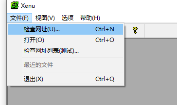


在弹出的运行指示框中最上方的输入框直接输入URL，以books.roqisoft.com为例，单击“确定”按钮开始检查


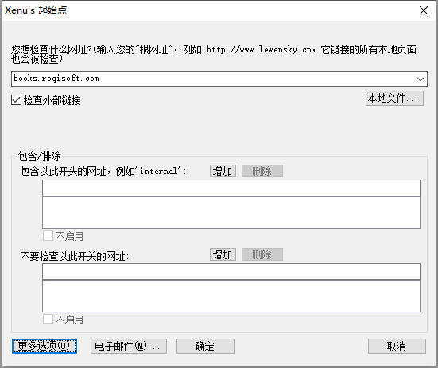


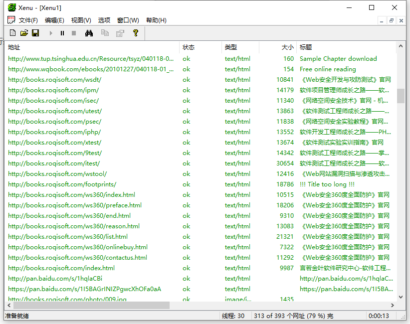


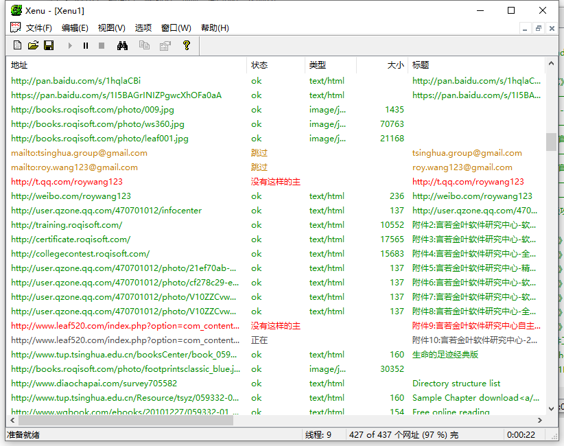


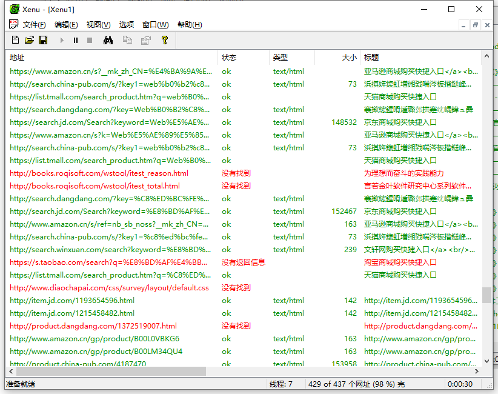


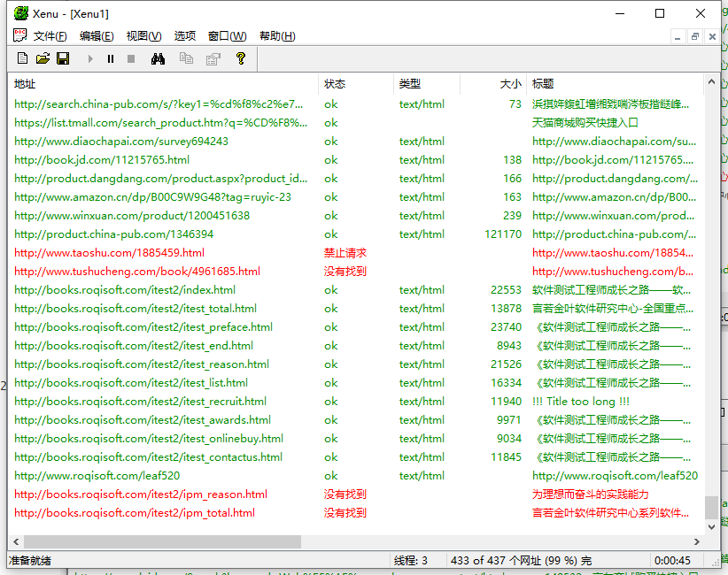


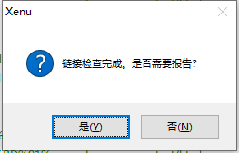


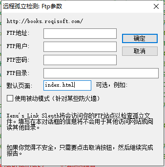


### 打开本地网页文件

现将需要检测的页面保存在本地计算机上，然后在运行指示窗口中单击Local file按钮，选择本地html的网页文件，单击“打开”按钮，再确定就可以检测了


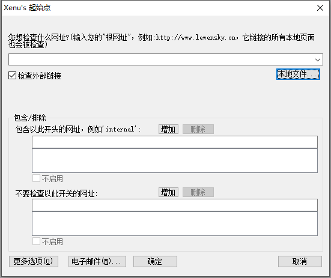


选择本地文件


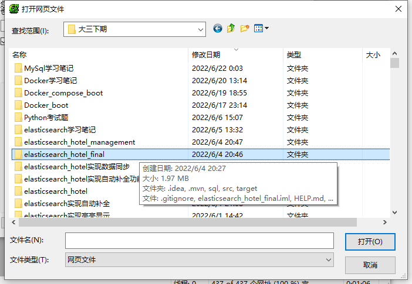


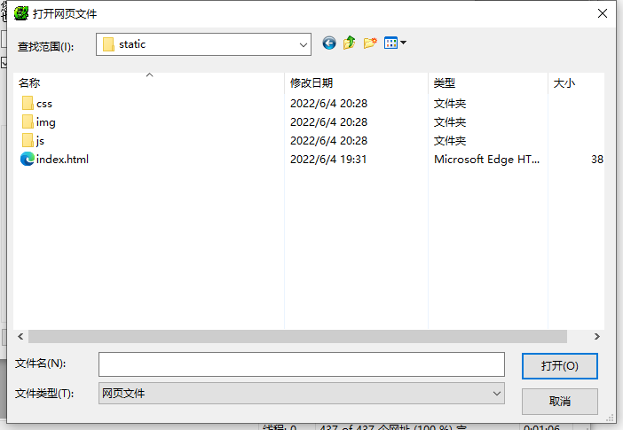


选择一个html文件后，点击打开


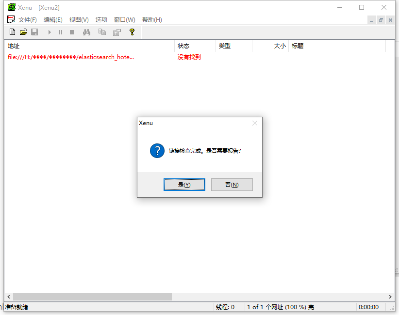


因为这个网页都是通过axios库去对后端服务发起异步Ajax请求的，所以几乎没有什么链接


### 同时检测多个URL

当需要检测多个网站时，可以将这些网站的URL列在一个.txt的文档中（每个URL地址一行），需要注意的是，这个文档中的URL地址必须是完整的，也就是要包括http://这个部分，像www.books.roqisoft.com这样的URL是检测不了的


现给定以下地址：

```
http://www.roqisoft.com/zhsx
http://www.oricity.com
http://demo.testfire.net
```


点击新建文本文档

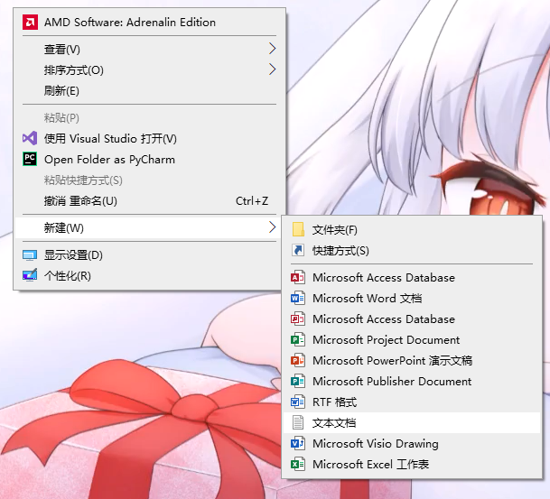


我取名为test.txt，名字随便


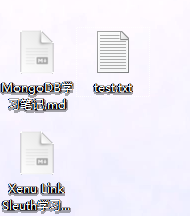


打开，粘贴，保存


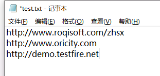


进入软件，在Xenu工具中，单击File-Check URL List，选择准备好的.txt文档，单击“确定”，就可同时开始检测


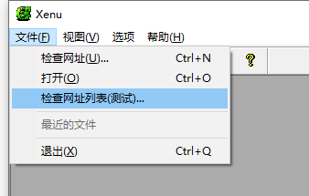


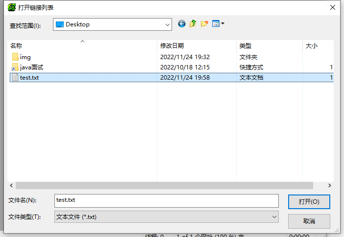


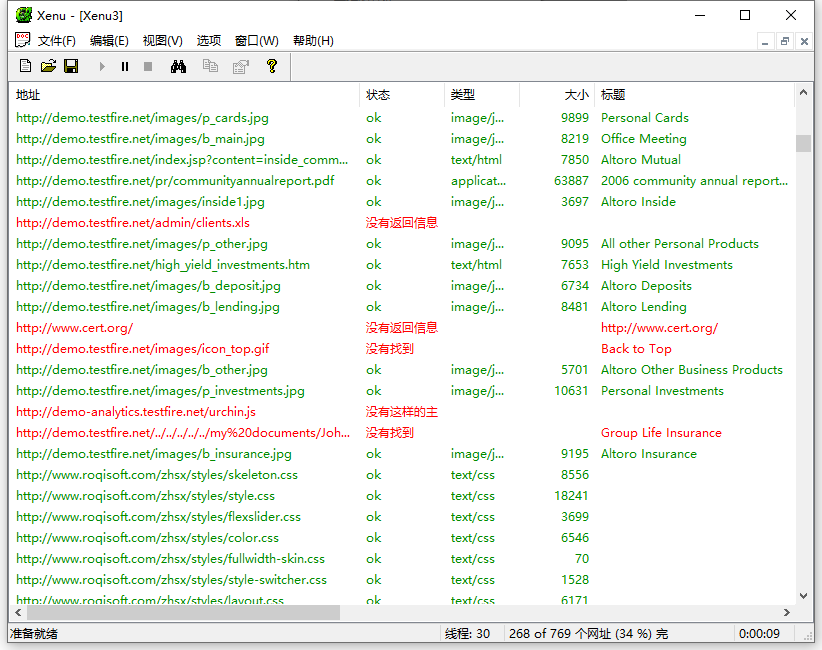


* 可以设置检查的链接层次：通过Options菜单设置检测链接的层次，也就是链接的深度，默认值999，其实不用这么大，一般两三层就可以了。

* 设置并列线程数：默认情况，会并行启动30个线程来对站点进行爬网检测，也可以根据实际情况将并行的线程数调整到1~100


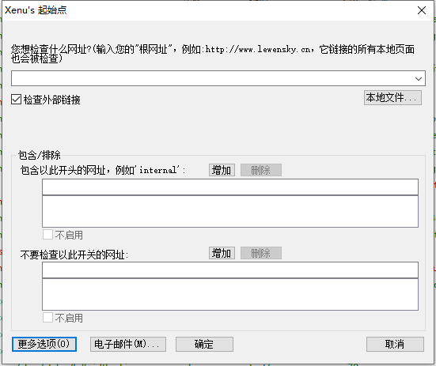

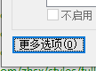


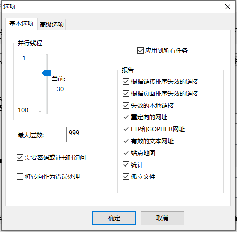


## 结果分析

不同的结果显示的颜色不同：

* 绿色字体：状态为ok
* 蓝色字体：跳过外部链接测试
* 红色字体：非正常状态，比如HTTP 404 资源位找到、HTTP 401 非法请求等


## 全面报告

最后会生成一个非常全面的报告，HTML格式


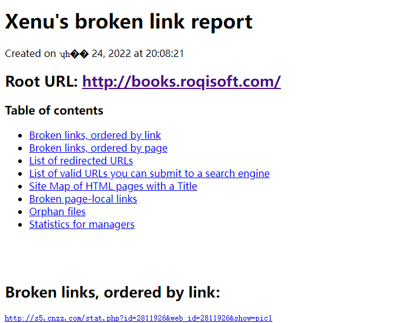


可点击标红的错误链接，右击鼠标，在快捷菜单中选择属性命令，对错误的网页进行查找和修改


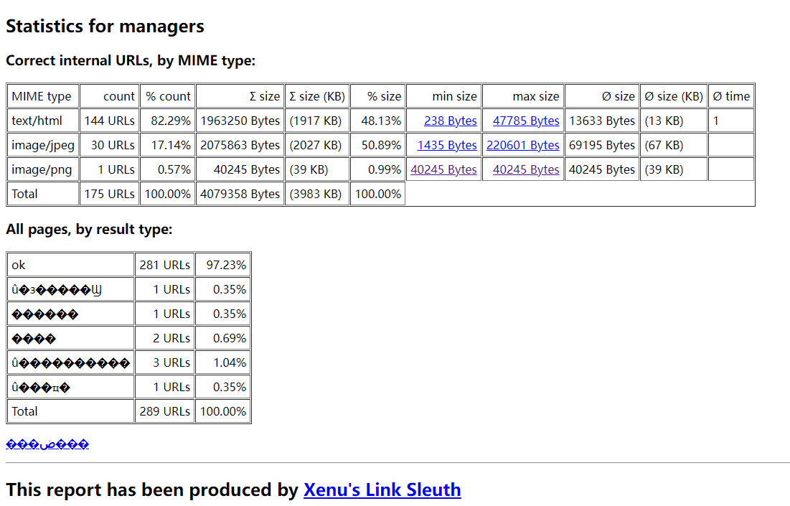


## 检测结果保存

报告默认保存HTML格式，也可以输出为Excel表，保存为.XEN文件


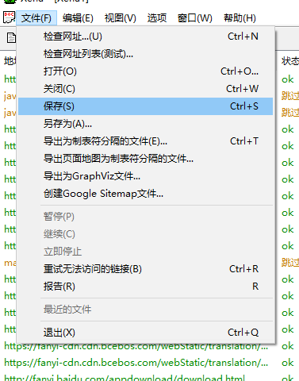


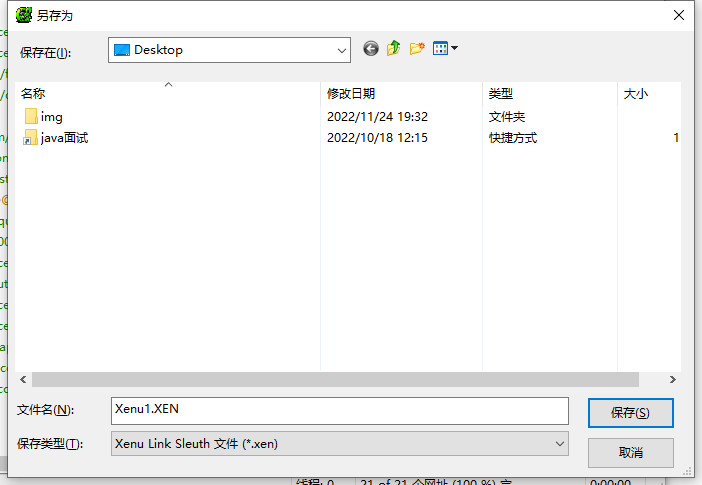


## 工具存在的问题分析

* 只检查链接是否有效，不检查是否正确
* 网速慢，可能会发生超时（Timeout）错误，导致无法得知目标链接到底是不是死链接
* 存在检测不准确的问题（极少，可以通过点击死链接，查看是否能链接正确来再次确认）


